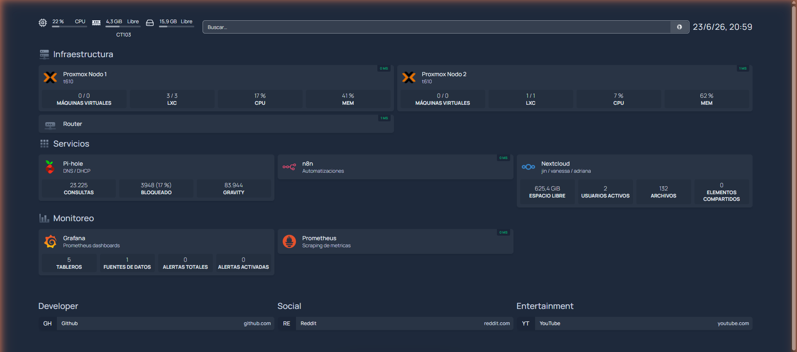
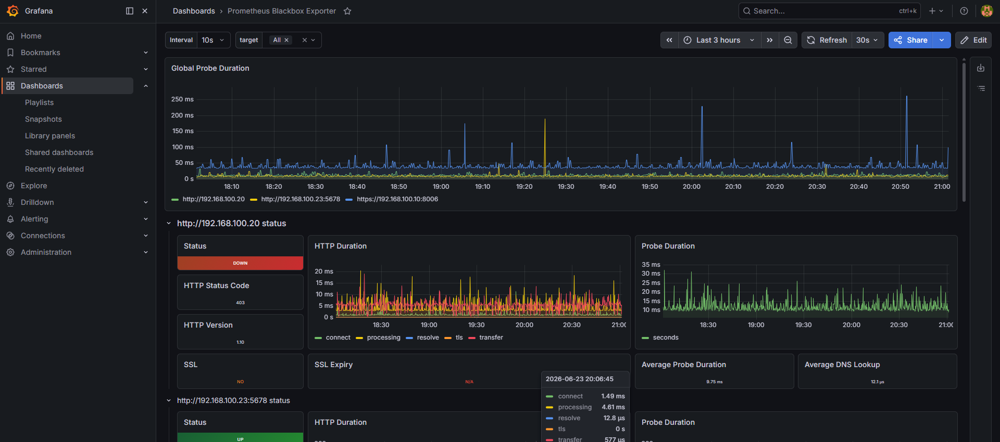
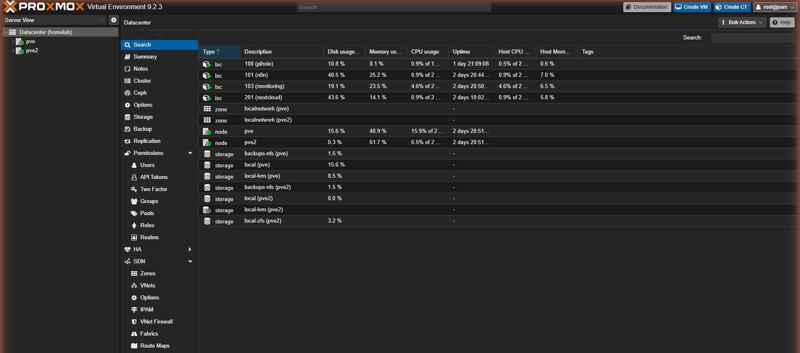

# Homelab — Infrastructure as Code


A 2-node bare-metal **Proxmox VE 9** cluster running self-hosted services in
LXC containers, provisioned declaratively with **Terraform** — extended with
Kubernetes (k3s), GitHub Actions CI/CD, and cloud infrastructure on AWS.

This repository is the source of truth for the container fleet: adding a service
is a few lines in [`terraform/containers.tf`](terraform/containers.tf) followed
by a single `terraform apply`.

> Network addresses in this repo use the example subnet `192.168.1.0/24`.
> Set your own values in `terraform.tfvars` / `variables.tf`.

## Architecture

```
┌─────────────────────────────────────────────────────────────┐
│                         GitHub                               │
│              push to main → triggers CI/CD pipeline          │
└──────────────────────┬──────────────────────────────────────┘
                       │ GitHub Actions (self-hosted runner)
                       ▼
             docker compose up + kubectl apply

[ pve  — node 1: services ]            [ pve2 — node 2: storage ]
  HP t610 · Debian 13                     HP t610 · Debian 13 · ZFS (1 TB, lz4)
  192.168.1.10                            192.168.1.11
  ├── CT100  Pi-hole    DNS/DHCP          ├── rpool/backups  → NFS export
  ├── CT101  n8n        automation        │     ▲ daily cluster-wide vzdump
  ├── CT102  k3s        Kubernetes        │       (7-day retention)
  └── CT103  monitoring Docker+CI/CD      └── CT201  Nextcloud (Docker + MariaDB)

         └──────────────── vzdump backups ─────────────────┘
```

Both nodes are joined in a single Proxmox cluster (`homelab-cluster`), so the
NFS backup datastore on node 2 is available cluster-wide.

## Screenshots

### Homepage dashboard
Live status of both Proxmox nodes, Pi-hole, n8n, Nextcloud, Grafana and Prometheus.



### Grafana — Blackbox Exporter
HTTP uptime and probe latency for Pi-hole, n8n and both Proxmox nodes.



### Grafana — Kubernetes (kube-state-metrics)
Pod state, deployments and cluster metrics scraped from k3s via Prometheus.

### Proxmox cluster
Two-node cluster (`pve` + `pve2`) with LXC containers and cluster storage.



## Services

| CT  | Service    | Node | IP           | Purpose                                             |
|-----|------------|------|--------------|-----------------------------------------------------|
| 100 | Pi-hole    | pve  | 192.168.1.20 | Network-wide DNS filtering and DHCP                 |
| 101 | n8n        | pve  | 192.168.1.23 | Workflow automation (Shopify → Telegram reporting)  |
| 102 | k3s        | pve  | 192.168.1.40 | Kubernetes cluster (k3s) + Helm                     |
| 103 | monitoring | pve  | 192.168.1.30 | Docker host: Prometheus, Grafana, Homepage, CI/CD   |
| 201 | Nextcloud  | pve2 | 192.168.1.41 | File sync & photo backup (Docker + MariaDB)         |

## Stack

- **Virtualization:** Proxmox VE 9 (2-node cluster), unprivileged LXC
- **IaC (homelab):** Terraform with the [`bpg/proxmox`](https://registry.terraform.io/providers/bpg/proxmox/latest) provider
- **IaC (cloud):** Terraform with the AWS provider (VPC, EC2, Security Groups)
- **Orchestration:** k3s (Kubernetes) + Helm v3
- **CI/CD:** GitHub Actions + self-hosted runner (Docker container in CT103)
- **Storage:** ZFS (lz4 compression) + NFS, automated `vzdump` backups with retention
- **Networking:** Pi-hole DNS/DHCP, Tailscale for secure remote access
- **Containers:** Docker / Docker Compose
- **Observability:** Prometheus + Grafana + kube-state-metrics + Blackbox Exporter

## Projects

### CI/CD Pipeline — GitHub Actions
**[`.github/workflows/deploy.yml`](.github/workflows/deploy.yml)**

Every push to `main` automatically:
1. Pulls updated Docker images
2. Redeploys the monitoring stack in CT103
3. Applies Kubernetes manifests to k3s in CT102
4. Verifies all pods are running

The runner is a Docker container in CT103 with access to the Docker socket
and the k3s kubeconfig (stored as a GitHub Actions secret).

### Kubernetes — k3s
**[`k8s/`](k8s/)**

Lightweight Kubernetes running in a Proxmox LXC container.

```bash
kubectl apply -f k8s/mi-app.yml -n portfolio
kubectl get all -n portfolio

# Self-healing demo — k8s recreates the pod automatically
kubectl delete pod <pod-name> -n portfolio
kubectl get pods -n portfolio --watch
```

### AWS Cloud Infrastructure
**[`cloud-engineer-portfolio/vpc-ec2/`](cloud-engineer-portfolio/vpc-ec2/)**

Full AWS networking stack deployed with Terraform on Free Tier:
VPC, public + private subnets, Internet Gateway, Security Groups, EC2 t2.micro.

```bash
cd cloud-engineer-portfolio/vpc-ec2/
terraform init && terraform apply
terraform destroy   # when done, avoids charges
```

### Monitoring stack
**[`monitoring/`](monitoring/)**

CT103 runs a Docker Compose observability stack:

- [`docker-compose.yml`](monitoring/docker-compose.yml) — Prometheus, Grafana,
  node-exporter, pihole-exporter, blackbox-exporter, Homepage dashboard, GitHub runner.
- [`prometheus.yml`](monitoring/prometheus.yml) — scrape config; Blackbox probes
  HTTP uptime on Pi-hole, n8n and both Proxmox nodes; kube-state-metrics scrapes k3s.
- [`blackbox.yml`](monitoring/blackbox.yml) — Blackbox Exporter `http_2xx` module.
- [`homepage/`](monitoring/homepage/) — Homepage dashboard config.

Secrets are injected via a git-ignored `.env` / `HOMEPAGE_VAR_*` variables;
[`monitoring/.env.example`](monitoring/.env.example) is committed as a template.

```bash
cd monitoring
cp .env.example .env        # fill in Grafana / Pi-hole passwords
docker compose up -d
```

## Usage

```bash
cd terraform

# 1. Provide your secrets (git-ignored)
cp terraform.tfvars.example terraform.tfvars
$EDITOR terraform.tfvars        # API token, container password, SSH keys

# 2. Initialize and review
terraform init
terraform plan

# 3. Apply
terraform apply
```

### Prerequisites

- Terraform >= 1.6
- A Proxmox API token (`Datacenter → Permissions → API Tokens`)
- The Debian 13 LXC template downloaded on each node
  (`pveam update && pveam download local debian-13-standard_...`)
- AWS CLI configured (for `cloud-engineer-portfolio/`)

## Secrets

No secrets are committed. Sensitive values are handled via:

- `terraform.tfvars` (git-ignored) or `TF_VAR_*` env vars — Proxmox API token, passwords, SSH keys
- GitHub Actions secrets — `KUBECONFIG_K3S` for k3s access from the runner
- `monitoring/.env` (git-ignored) — Grafana + Pi-hole passwords
- `*.tfstate` files are git-ignored (may contain sensitive values)

## Notes

The containers in this repo were originally created by hand and later codified
in Terraform as the cluster grew. To adopt the running containers into Terraform
state without recreating them, use `terraform import` per resource, e.g.:

```bash
terraform import 'proxmox_virtual_environment_container.ct["pihole"]' pve/100
```
